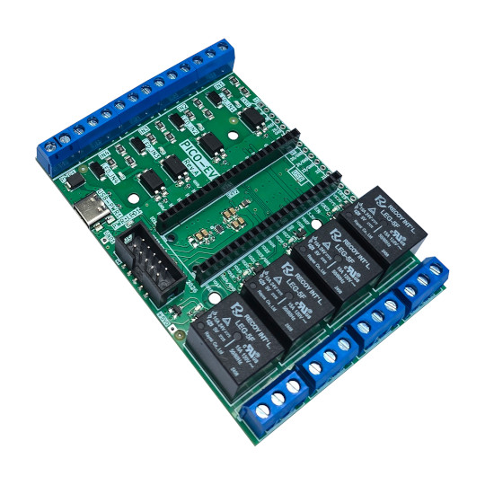

# PICO-EVB
Raspberry PICO/PICO-W evaluation board with optoisolated inputs 3.3-30VDC or 110-220VAC and Four Relays 15A/240VAC

https://www.olimex.com/Products/RaspberryPi/PICO/PICO-EVB/

## Licensee
* Hardware is released under CERN Open Hardware Licence Version 2 - Strongly Reciprocal
* Software is released under MIT Licensee
* Documentation is released under CC BY-SA 4.0